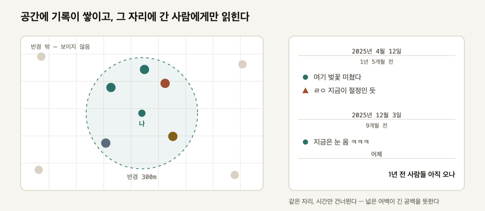
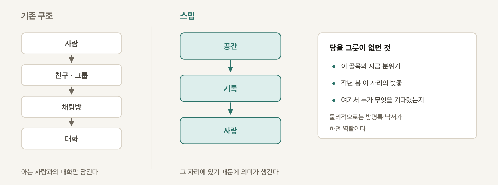
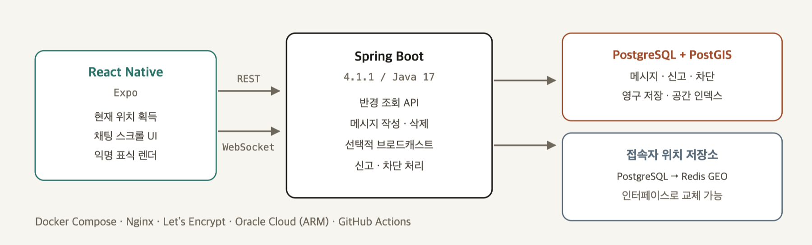
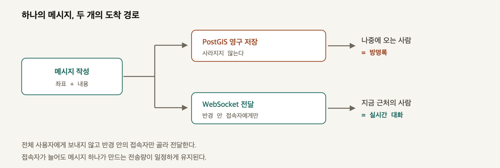

# 스밈 (Smim)

> 그 자리에 가야만 읽히는 익명의 기록

사용자의 현재 위치를 중심으로 **반경 300m** 안에 남겨진 익명 메시지를 시간순으로 읽고 이어 쓰는
위치 기반 커뮤니케이션 서비스입니다. 메시지는 사라지지 않고 좌표에 남아, 나중에 그 자리에 오는
사람에게 읽힙니다.

<p align="center">
  
</p>

같은 메시지가 **누가 언제 오느냐에 따라 성격이 달라집니다.** 지금 근처에 있는 사람에게는 실시간
대화로 도착하고, 몇 달 뒤 그 자리에 오는 사람에게는 기록으로 읽힙니다.

---

## 문제 정의

사람이 아닌 **공간에 기록이 귀속되는 커뮤니케이션**은 기존 메신저·SNS에서 다루기 어렵습니다.
Smim은 메시지를 특정 계정이 아닌 **좌표에 귀속**시켜, 그 장소에 있는 사람만 읽을 수 있도록 합니다.

<p align="center">
  
</p>

---

## 주요 기능

| 기능 | 설명 | |
|---|---|:---:|
| 현재 위치 획득 | OS 위치 서비스로 좌표 수신. 앱 사용 중에만, 백그라운드 권한 미요청 | ✅ |
| 하트비트 | 45초마다 `POST /presence` 로 위치 등록 | ✅ |
| 기기 익명 키 | 32바이트 난수를 기기에 보관, 서버는 SHA-256 해시만 저장 | ✅ |
| 채팅 스크롤 UI | 시간 구분선 · 익명 표식 · 인용 답글 · 내 글 우측 정렬 | ✅ |
| 반경 300m 메시지 조회 | PostGIS `ST_DWithin` + 커서 페이지네이션 | 🔜 |
| 메시지 작성 · 영구 저장 | TTL 없음. 좌표에 남는다 | 🔜 |
| 실시간 전달 | WebSocket · 반경 안 접속자에게만 선택 전달 | 🔜 |
| 신고 · 차단 · 삭제 | 신고 누적 시 자동 블라인드 | 🔜 |

### 이 서비스만의 화면 — 시간 구분선

```
──────── 2025년 4월 12일 ────────
          1년 5개월 전

  ● 여기 벚꽃 미쳤다
  ▲ ㄹㅇ 지금이 절정인 듯


          넓은 여백 = 긴 공백


──────── 2025년 12월 3일 ────────
            9개월 전

  ● 지금은 눈 옴 ㅋㅋㅋ
```

날짜가 주 라벨, **현재 기준 경과가 보조**입니다. 직전 블록과 3개월 이상 벌어지면 색이 아니라
**위 여백을 넓혀** 표현합니다 — 색은 "중요하다"를 뜻하지만 여기서 전하려는 건 "멀다"이기 때문입니다.

---

## Architecture

<p align="center">
  
</p>

메시지가 작성되면 **영구 저장과 실시간 전달을 함께** 수행합니다.

<p align="center">
  
</p>

접속자의 현재 위치는 메시지와 성격이 다른 데이터이므로 **별도 계층**으로 분리하고,
`PresenceStore` 인터페이스 뒤에 두어 PostgreSQL 구현과 Redis GEO 구현을 교체할 수 있게 했습니다.

---

## Tech Stack

| 영역 | 기술 |
|---|---|
| 모바일 | React Native (Expo SDK 57) · TypeScript · `react-native-svg` |
| 서버 | Spring Boot 4.1.1 · Java 17 · Gradle |
| 실시간 | WebSocket (STOMP) |
| 영속 저장 | PostgreSQL 17 + PostGIS 3.5 · Flyway |
| 현재 상태 | Redis 7.4 (GEO) |
| 인프라 | Docker Compose · Nginx · Let's Encrypt · Oracle Cloud (ARM) |
| 도구 | GitHub Actions · DBeaver · Expo Go |

---

## 핵심 기술 선택

### PostGIS — MySQL 대신

이 서비스에서 가장 자주 실행되는 연산은 **"내 주변 N미터 안의 메시지 찾기"** 입니다.

```sql
WHERE ST_DWithin(location, ST_MakePoint(:lon, :lat)::geography, :radius)
```

MySQL은 `ST_Distance_Sphere` 가 공간 인덱스를 타지 않아 사각 범위로 1차 필터링하는 우회가 필요합니다.
PostGIS의 `ST_DWithin` 은 **GiST 인덱스를 직접 사용**하므로 질의 한 줄로 끝납니다.
`GEOGRAPHY` 타입이 미터 단위를 직접 다뤄 좌표계 변환도 필요 없습니다.

→ [devlog 01 — 위치 기반 검색](docs/devlog/01-location-search.md)

### 위치 계층을 인터페이스 뒤에

```java
public interface PresenceStore {
    void upsert(String sessionId, String authorKey, Point location);
    void touch(String sessionId);
    List<String> findSessionsWithin(Point center, int radiusM);
    void remove(String sessionId);
    int purgeStale(Duration olderThan);
}
```

PostgreSQL로 먼저 구현하고 Redis GEO를 나중에 추가합니다. 설정 한 줄로 바뀝니다.

```yaml
smim.presence.store: postgres   # postgres | redis
```

**대안이자 실험 대상입니다.** 같은 호출 경로에 구현만 바꿔 끼우므로 두 방식의 성능을 공정하게
비교할 수 있습니다. → [`docs/tracks.md`](docs/tracks.md)

### 익명성 — 표시하지 않되 서버는 안다

이름도 닉네임도 화면에 없습니다. 대신 **도형 6종 × 색 4종**의 표식으로 발화자를 구분하고,
표식은 시간 구분선으로 나뉜 **구간 안에서만** 유효합니다.

서버는 기기 키의 SHA-256 해시만 보관합니다. 원본 키는 저장하지 않고, `author_key` 는
**어떤 응답에도 포함하지 않습니다.**

→ [devlog 04 — 익명 사용자 처리](docs/devlog/04-anonymous-user.md)

### 반경은 밀도에 따라 바뀌지 않는다

초안에서는 "메시지 30개가 모일 때까지 반경을 넓히는" 동적 반경을 설계했다가 폐기했습니다.
한적한 지역에서 반경이 수 km까지 늘어나면 **"그 자리"라는 전제가 무너지기** 때문입니다.

영구 저장을 택했으므로 같은 자리에 시간이 쌓입니다. **공간은 고정하고 시간을 풉니다.**

→ [`docs/location-policy.md`](docs/location-policy.md)

---

## 실행 방법

### 요구사항

- Docker
- JDK 17
- Node.js 20+
- Expo Go

### 실행

1. `.env.example` → `.env`
2. `docker compose up -d`
3. `cd server && ./gradlew bootRun`
4. `cd app && npm install && npx expo start`

> 실제 기기 테스트 시 Mac과 기기가 동일한 Wi-Fi에 있어야 합니다.

포트 변경, 앱의 서버 주소 설정, 동작 확인 방법은 [`docs/setup.md`](docs/setup.md)에 있습니다.

---

## Development Log

구현하면서 내린 결정과 막혔던 지점을 기록합니다. → **[전체 목록](docs/devlog/)**

| | 주제 | |
|---|---|:---:|
| 00 | [개발 환경 구축에서 막힌 것들](docs/devlog/00-environment.md) | ✅ |
| 01 | [위치 기반 검색 — PostGIS를 고른 이유](docs/devlog/01-location-search.md) | ✅ |
| 02 | Redis GEO — PostgreSQL과 무엇이 다른가 | 🔜 |
| 03 | WebSocket — 반경 기반 선택적 브로드캐스트 | 🔜 |
| 04 | [익명 사용자 처리](docs/devlog/04-anonymous-user.md) | ✅ |
| 05 | 동시성 문제 | 🔜 |

---

## 설계 문서

| 문서 | 내용 |
|---|---|
| [`docs/tracks.md`](docs/tracks.md) | A(Redis) · B(PostgreSQL) · +A(확장) 구분과 진행 순서 |
| [`docs/scope.md`](docs/scope.md) | MVP·확장 범위, 주차별 일정, 포기 순서 |
| [`docs/api.md`](docs/api.md) | 앱↔서버 계약, 인증, 엔드포인트 |
| [`docs/location-policy.md`](docs/location-policy.md) | 반경 정책, 위치 갱신 규칙, `/config` 스펙 |

## 설계 결정

구조를 규정하는 일곱 개의 결정입니다. 배경·대안·기각 이유는
**[`docs/decisions/`](docs/decisions/)** 에 하나씩 기록했습니다.

| | 결정 | |
|---|---|---|
| **D1** | 반경의 중심은 사용자다 — 격자로 나누지 않는다 | [→](docs/decisions/D1-user-centered-radius.md) |
| **D2** | 반경은 밀도에 따라 바뀌지 않는다 — 기본 300m | [→](docs/decisions/D2-fixed-radius.md) |
| **D3** | 메시지는 만료되지 않는다 | [→](docs/decisions/D3-no-expiry.md) |
| **D4** | 이름은 없고, 구간 표식만 있다 | [→](docs/decisions/D4-anonymous-marker.md) |
| **D5** | 실시간 전달과 영구 저장을 동시에 수행한다 | [→](docs/decisions/D5-hybrid-delivery.md) |
| **D6** | 관계 대신 반응으로 재방문을 만든다 | [→](docs/decisions/D6-reaction-over-relationship.md) |
| **D7** | 시간은 날짜를 주 라벨로, 경과를 보조로 표기한다 | [→](docs/decisions/D7-time-labeling.md) |
